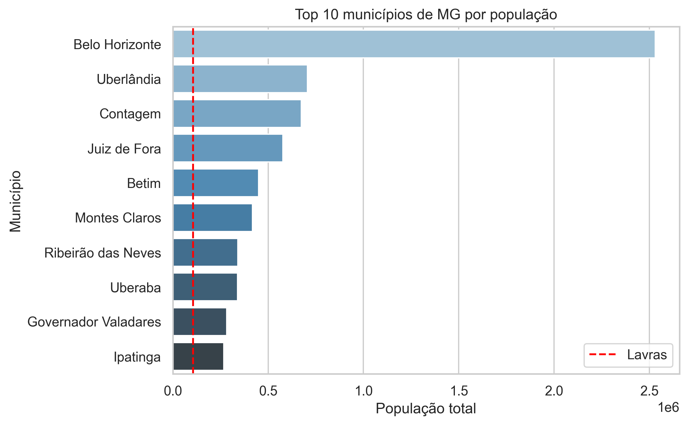
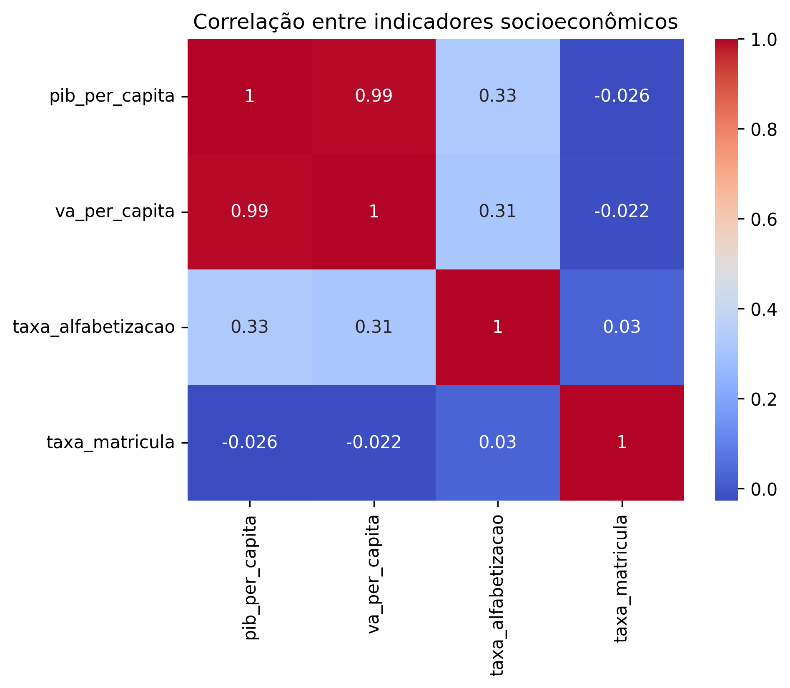
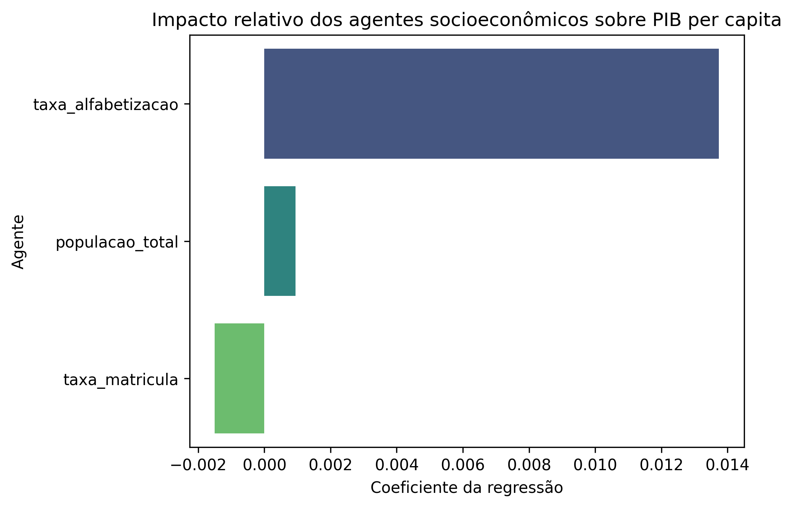
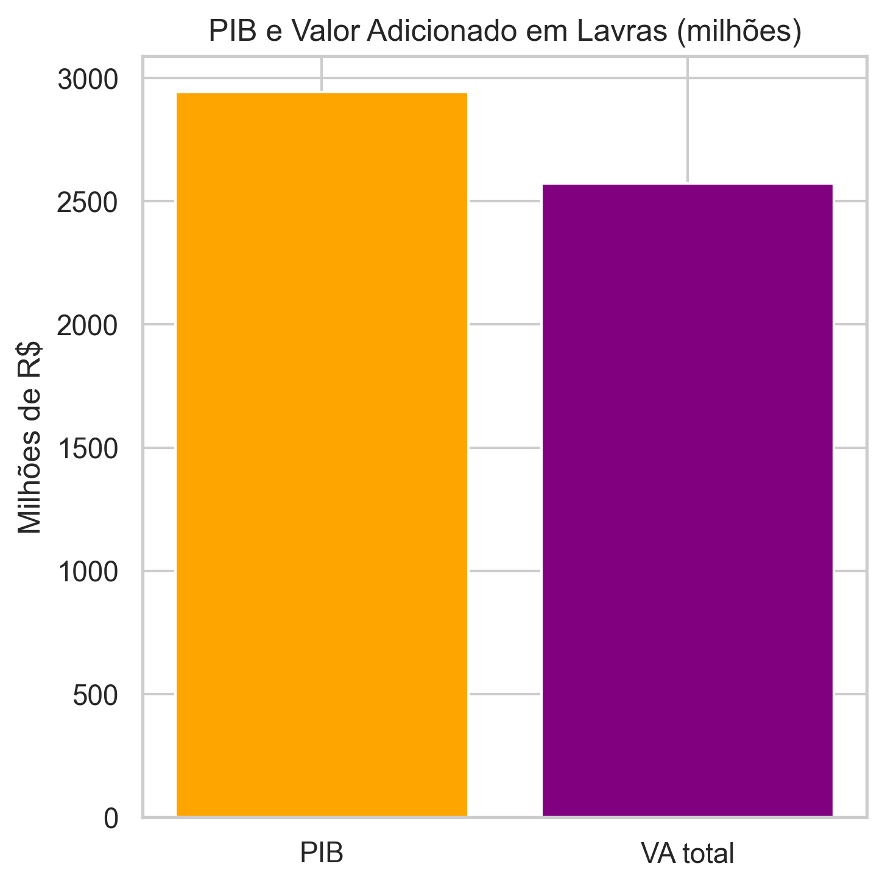

# Desafio ZettaLab - Ciência e Governança de Dados

O projeto é um trabalho realizado individualmente na trilha "Ciência e Governança de Dados" do projeto ZettaLab da UFLA (Universidade Federal de Lavras). O desafio proposto foi de acessar e reunir diversas bases de dados brasileiras relevantes que incluem informações capazes de avaliar as condições socioeconômicas e seus determinantes multifatoriais, a qual seja feito limpeza e tratamento dos dados, análise estatística inicial e identificação de padrões, correlações e tendências relevantes, e realizar análise exploratória cujo proposito é gerar insights sobre eles. Importante ressaltar que devido ao tamanho dos datasets escolhidos, nosso foco será no múnicipio de Lavras, localizado em Minas Gerais, a fim de facilitar a analise e processamento.

## Índices

- [Estrutura do Projeto](#estrutura-do-projeto)
- [Datasets Escolhidos](#datasets-escolhidos)
- [Instalação](#instalação)
- [Modelo de IA](#modelo-de-ia)
- [Principais Insights](#principais-insights)
- [Responsável](#responsável)

## Estrutura do Projeto

```bash
.
├── Desafio 1.pdf                                   # Arquivo PDF descrevendo o desafio da ZettaLab
├── README.md                                       # Arquivo README do Projeto
├── data                                            # Pasta dos dados Brutos e Processados utilizados no projeto
│   ├── processed                                   # Pasta de arquivos Processados
│   │   ├── alfabetizacao_processada.csv
│   │   ├── brasil_info.csv
│   │   ├── educacao_basica_sexo_raca_cor.csv
│   │   ├── indicadores_lavras.csv
│   │   ├── indicadores_lavras_completo.csv
│   │   ├── lavras_info.csv
│   │   ├── mg_info.csv
│   │   ├── quantidade_total_matriculas_alfabetizacao.csv
│   │   ├── quantidade_total_matriculas_alfabetizacao_dividida_mun.csv
│   │   ├── tamanho_municipios_2024.csv
│   │   ├── tamanho_populacional_mun.csv
│   │   ├── tamanho_populacional_uf.csv
│   │   ├── tamanho_uf_2024.csv
│   │   └── trad_municipio_tratados.csv
│   └── raw                                             # Pasta de arquivos Brutos
│       ├── Dados_Tamanho_Brasil.ods
│       ├── alfabetizacao_por_sexo,raca_e_idade.csv
│       ├── pip_por_municipio.csv
│       ├── pip_por_uf.csv
│       ├── populacao_brasileira.csv
│       └── traducao_municipios.csv
├── metrics                                             # Pasta de métricas geradas
│   ├── impacto_rel_agentes_socioeconomicos_pib_per_capita.png
│   ├── matriz_correlacao_lavras.png
│   ├── pib_vs_valor_adicionado_em_lavras.png
│   ├── pop_lavras_vs_top10_mun_mg.png
│   └── taxa_alfabetizacao_lavras_vs_mg.png
├── notebooks                                           # Pasta dos notebooks usados
│   ├── 1_coleta_preparacao_dados.ipynb
│   ├── 2_analise_exploratoria.ipynb
│   └── 3_modelo_predicao.ipynb
└── requirements.txt                                    # Arquivo de dependencias necessárias para rodar os notebooks
```

## Datasets Escolhidos

Abaixo estão os datasets que foram selecionados para o projeto, sua descrição, e uso. O foco do problema é estudar os fatores socioeconomicos e multifatoriais que afetam o múnicipio de Lavras, localizado em Minas Gerais. Para isso, utilizamos desde de dados gerais do Brasil todo, como tambem, sobre seus estados, e Lavras em si. O foco da análise foi a partir de questões mais sociais, demográficas, e economicas, as quais estão apresentadas abaixo:

### [Base dos Dados](https://basedosdados.org/)

#### [Indice de Gini - UF](https://basedosdados.org/dataset/fcf025ca-8b19-4131-8e2d-5ddb12492347?table=a5e13468-e1e4-4125-92e6-89d3b9c85e18)

O índice de Gini, chamado também de coeficiente de Gini, é um indicador que mensura a distribuição de renda em um território (no caso do dataset, a nível estadual). Por meio dele, é possível determinar a desigualdade social e a concentração de renda em diferentes níveis territoriais, além de estabelecer comparativos entre eles.

#### [Produto Interno Bruto (PIB) Por Municipio](https://basedosdados.org/dataset/fcf025ca-8b19-4131-8e2d-5ddb12492347?table=fbbbe77e-d234-4113-8af5-98724a956943)

Dados do PIB por Município permitem realizar comparações entre Lavras e outros múnicipios do Brasil, podendo usar seus fatores economicos para entender seu desenvolvimento e quais são mais relevantes.

#### [Produto Interno Bruto (PIB) Por UF](https://basedosdados.org/dataset/fcf025ca-8b19-4131-8e2d-5ddb12492347?table=93007431-7ce9-42ee-8740-8c2274d345ad)

Dados do PIB por UF permitem realizar comparações entre diferentes estados do Brasil. Como Lavras é um múnicipio de Minas Gerais, o intuito é entender se ele está comforme os padrões e tendências do estado de Minas Gerais.

#### [População Brasileira](https://basedosdados.org/dataset/1e2b9a88-9dc7-4f0e-a3a5-e8d2a13869bf?table=1a8d9636-c11d-443b-ae83-1b00576f0b70)

Dados da População Brasileira inteira permitem realizar diversas operações em todo o brasil, desde de pequenas como em múnicipios e para todo o Brasil. A partir dele, são realizadas estimativas da quantidade populacional dos UFs a partir das projeções do número de habitantes em cada Múnicipio. 

#### [Tabela de Tradução de Múnicipios](https://basedosdados.org/api/tables/downloadTable?p=YnJfYmRfZGlyZXRvcmlvc19icmFzaWw=&q=bXVuaWNpcGlv&d=dHJ1ZQ==&s=ZnJlZQ==)

Esta tabela tem como propósito auxiliar a Ciência de Dados ao traduzir identificadores de UFs e Múnicipios. Ele serve como forma de integrar diversas informações diferentes atráves de chaves universais e padronizadas do governo.

#### [Censo 2022 - Alfabetização por Sexo, Raça e Grupo de Idade](https://basedosdados.org/dataset/08a1546e-251f-4546-9fe0-b1e6ab2b203d?table=cf9537b5-6198-455f-a8b0-7c762e94d79c)

Tabela contem dados de pessoas de 15 anos ou mais de idade, total e as alfabetizadas, por sexo, cor ou raça e grupos de idade. Alfabetização é diferente de Educação Básica, já que se refere a capacidade de ler e escrever, enquanto a outra trata de aspectos formal, por exemplo: Ensino Médio Incompleto, Mestrado Completo, entre outros.

#### [Educação Básica - Sexo Raça Cor](https://basedosdados.org/dataset/386927a4-4ee8-4975-8ff3-beece3474942?table=2eaf0bb5-8d7b-4d54-ae1a-85edf58c6978)

A base conta com o total de matrículas por município para todas as etapas de ensino, sexo e raça/cor.

### [Area IBGE](https://www.ibge.gov.br/geociencias/organizacao-do-territorio/estrutura-territorial/15761-areas-dos-municipios.html?t=acesso-ao-produto&c=1)

Essa tabela oferecem informações relacionadas ao tamanho territorial do brasil ao decorrer dos anos. Foi a partir dele que cálculos como densidade populacional foram realizados.

## Instalação

O projeto usou o Jupyter Notebook, e por padrão, os dados csv necessários já estão salvos numa pasta dedicada a eles. Não é preciso executar o projeto pois as saídas originais já estão preservadas. Logo, certas partes do tutorial de como acessar podem ser puladas (esses que estarão explicitos ao decorrer do README.md). Contudo, caso queira realizar o build completo do zero e executar tudo no Notebook, siga todo que esteja escrito.

### Pré-requisitos

- [Python 3.13.1](https://www.python.org/)
- pip (Gerenciador de Pacotes do Python)

### Passo-a-Passo

No terminal Git Bash, clone o repositório:
```bash
git clone https://github.com/EstevaoAugusto/ZettaLab-2ed-Desafio-Ciencia-e-Governanca-de-Dados.git
```

Entre na pasta:
```bash
cd ZettaLab-2ed-Desafio-Ciencia-e-Governanca-de-Dados
```

Criar e ative o Ambiente Virtual do Python:
```bash
python -m venv .venv
source ./.venv/Scripts/activate
```

Atualize o pip e instale as dependências:
```bash
python -m pip install --upgrade pip
pip install -r requirements.txt
```

Crie um arquivo .env
```bash
touch .env
```

Cadastre uma conta no Google Cloud, e crie um projeto. Após isso, coloque seu ID Project no .env
```bash
echo "GOOGLE_CLOUD_ID_PROJECT='<seu-projeto-id>'" > .env
```

Execute os notebooks sequencialmente na pasta "notebooks"

```bash
cd notebooks
python run_pipeline.py
```

## Modelo de IA

### Treinamento

### Acurácia

### Predição


## Principais Insights

Abaixo são os insights obtidos após a execução de todos os notebooks. Veremos como dados multifatorais e socioeconomicos podem afetar o múnicipio de Lavras.

### Comparação entre Múnicipios de MG


Nessa tabela, vemos a distribuição de taxa de alfabetização em MG, onde comparamos Lavras com outros múnicipios de Minas Gerais. Na estátistica acima, vemos que Lavras possui uma taxa de alfabetização maior que mais da metade dos múnicipios, ao ter um valor aproximado de 80%. Isso indica que boa parte da população sabe ler e escrever, fator esse que afeta suas oportunidades para conseguirem melhores empregos, continuar os estudos, e possibilidade de participar numa democracia.



Comparando o número total populacional de Lavras com os 10 municípios mais populosos de Minas Gerais, notamos que seu valor se encontra muito abaixo deles. Como entendemos que Lavras possuí uma Taxa de Alfabetização maior que a média, pode-se dizer que seu número de habitantes mais baixo afetam na quantidade de pessoas que conseguem ler e escrever no estado de Minas Gerais.

### Correlação de Indicadores Socioeconomicos em Lavras



Na matriz de correlação, observamos como alguns indicadores de Lavras se relacionam entre si:

- O PIB per capita e o Valor Bruto Total a Preços Correntes per capita apresentam forte correlação, indicando que municípios com maior PIB per capita tendem a ter também maior Valor Bruto Total per capita.

- A correlação entre a Taxa de Alfabetização e o PIB per capita, assim como entre a Taxa de Alfabetização e o Valor Bruto Total per capita, foi moderada, sugerindo que municípios com maior renda tendem a ter maior alfabetização, embora essa relação não seja sempre consistente.

- A correlação entre a Taxa de Alfabetização e a Taxa de Matrícula foi a menor positiva, mostrando que a matrícula escolar nem sempre se traduz em alfabetização efetiva.

- Os demais indicadores apresentaram correlação negativa, indicando que aumentos em certos indicadores estão associados a reduções em outros.

### Impacto relativo dos agentes socioeconômicos sobre PIB per capita



Tabela acima demonstra o impacto que determinados agentes socioeconomicos possuem sobre o PIB per Capita. Pode-se obter os seguintes insights a partir dele:

- A Taxa de Alfabetização possui o maior Coeficiente de Regressão, sendo ele de valor positivo. Isso indica que o aumento desse agente é o principal motor para o crescimento do PIB per capita.

- O Total Populacional é um agente que traz impacto positivo, mas que é o mais fraco de todos. Não causando muita diferença no PIB per capita.

- A Taxa de Matricula apresenta um impacto negativo, porém fraco. Um aumento nesta taxa está associado a uma ligeira queda no PIB per capita, o que pode indicar custos de curto prazo ou complexidades no modelo.

### PIB e Valor Adicionado em Lavras (milhões)



A tabela acima compara o PIB e o Valor Adicionado Total do município de Lavras. Nele, vemos que o PIB é superior ao VA Total. O principal insight é que a diferença entre esses dois valores, que representa os Impostos Líquidos sobre Produtos, é um componente substancial na composição da riqueza total gerada em Lavras, destacando a importância da arrecadação fiscal sobre bens e serviços para a economia municipal.

## Responsável

- Estevão Augusto da Fonseca Santos, Graduando em Ciência de Computação (6° Período)