# Desafio ZettaLab - Ciência e Governança de Dados

O projeto é um trabalho realizado individualmente na trilha "Ciência e Governança de Dados" do projeto ZettaLab da UFLA (Universidade Federal de Lavras). O desafio proposto foi de acessar e reunir diversas bases de dados brasileiras relevantes que incluem informações capazes de avaliar as condições socioeconômicas e seus determinantes multifatoriais, a qual seja feito limpeza e tratamento dos dados, análise estatística inicial e identificação de padrões, correlações e tendências relevantes, e realizar análise exploratória cujo proposito é gerar insights sobre eles. Importante ressaltar que devido ao tamanho dos datasets escolhidos, nosso foco será no múnicipio de Lavras, localizado em Minas Gerais, a fim de facilitar a analise e processamento.

## Índices

- [Estrutura do Projeto](#estrutura-do-projeto)
- [Metodologia CRISP-DM](#metodologia-crisp-dm)
- [Instalação](#instalação)
- [Datasets Escolhidos](#datasets-escolhidos)
- [Dicionário de Dados](#dicionário-de-dados)
- [EDA](#exploration-data-analyticseda)
- [Modelo de IA](#modelo-de-ia)
    - [K-Means](#clusterização-por-k-means)
    - [Random Forest Regressor](#random-forest-regressor)
    - [Regressão Linear](#regressão-linear-múltipla)
- [Importância das Variáveis via SHAP](#importância-das-variáveis-via-shap)
- [Insights](#insights)
- [Limitações e Futuras Implementações](#limitações-e-futuras-implementações)
- [Responsável](#responsável)

## Estrutura do Projeto

```bash
.
├── CONTRIBUTING.md
├── Desafio 1.pdf
├── Desafio 2.pdf
├── E-book Ciência e Governança de Dados.pdf
├── README.md
├── __pycache__
│   └── config_path.cpython-313.pyc
├── anotacao.txt
├── config_path.py
├── data
│   ├── processed
│   │   ├── alfabetizacao_processada.csv
│   │   ├── brasil_info.csv
│   │   ├── indicadores_lavras_completo.csv
│   │   ├── lavras_info.csv
│   │   ├── mg_info.csv
│   │   ├── quantidade_total_matriculas_alfabetizacao.csv
│   │   ├── quantidade_total_matriculas_alfabetizacao_dividida_mun.csv
│   │   ├── tamanho_municipios_2024.csv
│   │   ├── tamanho_populacional_mun.csv
│   │   ├── tamanho_populacional_uf.csv
│   │   ├── tamanho_uf_2024.csv
│   │   └── trad_municipio_tratados.csv
│   └── raw
│       ├── Dados_Geograficos_Brasil_Inteiro.ods
│       ├── alfabetizadas_por_sexo_cor_ou_raca_e_idade_original.ods
│       ├── educacao_basica_sexo_raca_cor.csv
│       ├── indice_de_gini_uf.csv
│       ├── pip_por_municipio_original.csv
│       ├── pip_por_uf_original.csv
│       ├── populacao_brasileira.csv
│       └── traducao_municipios.csv
├── features
│   └── informacoes_cada_municipio_2019_clusterizado.csv
├── imgs
│   ├── Diagrama-de-funcionamento-do-modelo-CRISP-DM.png
│   ├── K-Means-Clusterizacao.png
│   ├── Random-Forest-Regressao.png
│   └── Regressao-Linear.jpg
├── interactive_reports
│   ├── 01_industria_vs_servicos_no_pib.html
│   ├── 02_hierarquia_de_impacto_agentes_explicam_PIB.html
│   └── 03_mapa_clusters_2020_destaque_lavras.html
├── metrics
├── models
│   ├── clusterizacao_k_means_municipios_2019.pkl
│   ├── ia_random_forest_regressao.joblib
│   └── regressao_linear_prever_pib_per_capita.pkl
├── notebooks
│   ├── 1_coleta_preparacao_dados.ipynb
│   ├── 2_analise_exploratoria.ipynb
│   ├── 3_aplicacao_ia.ipynb
│   └── run_notebooks.py
├── reports
│   ├── 01_taxa_alfabetizacao_lavras_vs_mg.png
│   ├── 02_pop_lavras_vs_top10_mun_mg.png
│   ├── 03_evolucao_pib_vs_va_lavras.png
│   ├── 04_grafico_evo_indice_gini_medio_por_setor.png
│   ├── 05_matriz_correlacao_mun_brasil_2016_a_2020.png
│   ├── 06_matriz_correlacao_todos_os_municipios_mg_2016_a_2020.png
│   ├── 07_scatter_plot_pib_pop_mg_2016_2020.png
│   ├── 08_barplot_metodo_cotovelo.png
│   ├── 09_barplot_media_pib_per_capita_por_cluster_hierarquico.png
│   ├── 09_distribuicao_municipios_por_nivel_de_riqueza_colorido.png
│   ├── 10_distribuicao_municipios_por_nivel_de_riqueza_lavras.png
│   ├── 11_distribuicao_clusters_minas_gerais.png
│   ├── 12_boxplot_distribuicao_pib_per_capita_por_cluster_hierarquico.png
│   ├── 13_barplot_importancia_das_variaveis_predicao_do_pib_per_capita.png
│   ├── 14_scatterplot_comparacao_predito_real_random_forest_pib_per_capita.png
│   ├── 15_histplot_distribuicao_dos_erros_random_forest_pib_per_capita.png
│   ├── 16_scatterplot_diferenca_entre_pib_per_capita_real_vs_predicao.png
│   ├── 17_scatterplot_analise_de_residuos_pib_per_capita_real_predicao_regressao_linear.png
│   ├── 18_impacto_rel_agentes_socioeconomicos_pib_per_capita.png
│   └── 19_SHAP_impacto_agentes_socioeconomicos_pib_per_capita.png
├── requirements.txt            # Arquivo de dependencias para o deploy
├── requirements_dev.txt        # Arquivo de dependencias para execução local
├── shap_values_backup.npy
└── teste.txt
```

## Metodologia CRISP-DM

Este projeto segue a metodologia **CRISP-DM** (Cross-Industry Standard Process for Data Mining), padrão mundial para projetos de ciência de dados.

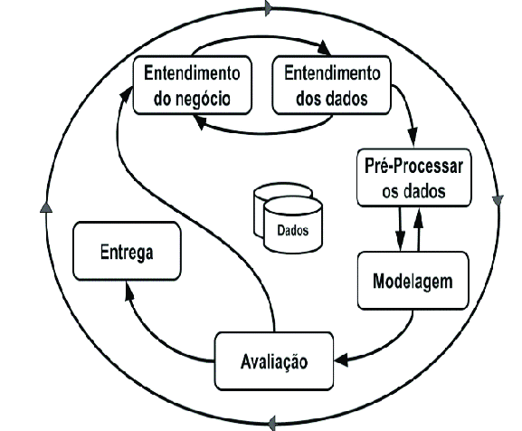

- **Entendimento do negócio**: A primeira etapa é, possivelmente, a mais importante de todo o processo. Caso ela não seja feita da maneira correta, todo o resto do projeto pode ser invalidado futuramente. Nesta etapa, é definido o objetivo do projeto e as necessidades da empresa ou projeto em análise. Por isso, é necessário que todos estejam bem-informados e completamente alinhados.
- **Compreensão dos dados**: Depois da primeira etapa, podemos começar a pensar nos dados que serão utilizados no processo. Para isso podemos fazer várias perguntas, como: “A empresa tem banco de dados? Os dados serão acessados de que forma? Quantas fontes de dados serão utilizadas? Quais serão os formatos dos dados? Os dados estão estruturados?”. A partir delas, é feita a coleta dos dados, tomando cuidado para que nenhuma informação importante fique de fora. 
- **Preparação dos dados**: Com os dados já coletados, é preciso organizá-los de modo a conseguirmos enxergar o que eles contam. Esta etapa também pode ser guiada por algumas perguntas: “Como os valores nulos devem ser tratados? Os atributos estão nos formatos corretos? Será necessário fazer alguma fusão com outros dados? Quais variáveis serão utilizadas na modelagem?”. Esta costuma ser a parte mais demorada e trabalhosa de todas, porém um bom trabalho aqui significa menos retrabalho futuro.
- **Modelagem**: Nesta etapa o modelo começa a tomar forma e podemos ver os primeiros resultados. O tipo de modelagem a ser utilizada normalmente é definida de acordo com a necessidade do negócio e com o tipo de variável a ser analisada. Com a definição de qual modelo será utilizado, devem ser definidos quais atributos serão variáveis na construção deste modelo. “Aqui pode ser muito útil voltar à primeira etapa para conferir objetivos e encontrar novas possibilidades”, aconselha Prado.
- **Implementação**: Com o modelo já em mãos, podemos avaliar se o se o resultado corresponde à expectativa do projeto. Caso a resposta seja negativa ou a equipe considere que há espaço para melhorias, todas as forças devem ser direcionadas para fazer as mudanças necessárias. Estas mudanças podem ter diversas formas, como a retirada de atributos estatisticamente insignificantes, correção na entrada de dados, correção no tratamento dos atributos etc.
- **Entrega (Deployment)**: Caso o processo tenha sido feito da maneira correta, esta será a última etapa. Aqui, o modelo deve ser colocado em produção, de modo a agregar valor para o negócio. A forma como isso é feito varia muito, dependendo do tipo de modelo e projeto. Esse modelo deve ficar exposto para acesso, normalmente armazenado na nuvem ou em servidores locais da própria empresa.

## Instalação

O projeto usou o Jupyter Notebook, e por padrão, os dados csv necessários já estão salvos numa pasta dedicada a eles. Não é preciso executar o projeto pois as saídas originais já estão preservadas. Logo, certas partes do tutorial de como acessar podem ser puladas (esses que estarão explicitos ao decorrer do README.md). Contudo, caso queira realizar o build completo do zero e executar tudo no Notebook, siga todo que esteja escrito.

### Pré-requisitos

- [Python 3.13.1](https://www.python.org/)
- pip (Gerenciador de Pacotes do Python)

### Passo-a-Passo

No terminal Git Bash, clone o repositório:
```bash
git clone https://github.com/EstevaoAugusto/ZettaLab-2ed-Desafio-Ciencia-e-Governanca-de-Dados.git
```

Entre na pasta:
```bash
cd ZettaLab-2ed-Desafio-Ciencia-e-Governanca-de-Dados
```

Criar e ative o Ambiente Virtual do Python:
```bash
python -m venv .venv
source ./.venv/Scripts/activate
```

Atualize o pip e instale as dependências 'requirements_dev.txt':
```bash
python -m pip install --upgrade pip
pip install -r requirements_dev.txt
```

Crie um arquivo .env
```bash
touch .env
```

Cadastre uma conta no Google Cloud, e crie um projeto. Após isso, coloque seu ID Project no .env
```bash
echo "GOOGLE_CLOUD_ID_PROJECT='<seu-projeto-id>'" > .env
```

Execute os notebooks sequencialmente na pasta "notebooks". Após isso, acesse a dashboard a partir do comando abaixo:

```bash
streamlit run app.py
```

Caso queire acessar os resultados em dashboard, acesse o link abaixo:

https://desafio-zettalab-ciencia-e-governanca-de-dados.streamlit.app/

## Datasets Escolhidos

Abaixo estão os datasets que foram selecionados para o projeto, sua descrição, e uso. O foco do problema é estudar os fatores socioeconomicos e multifatoriais que afetam o múnicipio de Lavras, localizado em Minas Gerais. Para isso, utilizamos desde de dados gerais do Brasil todo, como tambem, sobre seus estados, e Lavras em si. O foco da análise foi a partir de questões mais sociais, demográficas, e economicas, as quais estão apresentadas abaixo:

### [Base dos Dados](https://basedosdados.org/)

#### [Indice de Gini - UF](https://basedosdados.org/dataset/fcf025ca-8b19-4131-8e2d-5ddb12492347?table=a5e13468-e1e4-4125-92e6-89d3b9c85e18)

O índice de Gini, chamado também de coeficiente de Gini, é um indicador que mensura a distribuição de renda em um território (no caso do dataset, a nível estadual). Por meio dele, é possível determinar a desigualdade social e a concentração de renda em diferentes níveis territoriais, além de estabelecer comparativos entre eles. Utilizei os dados que vão de 2002 a 2021.

#### [Produto Interno Bruto (PIB) Por Municipio](https://basedosdados.org/dataset/fcf025ca-8b19-4131-8e2d-5ddb12492347?table=fbbbe77e-d234-4113-8af5-98724a956943)

Dados do PIB por Município permitem realizar comparações entre Lavras e outros múnicipios do Brasil, podendo usar seus fatores economicos para entender seu desenvolvimento e quais são mais relevantes. Utilizei os dados que vão de 2016 a 2020.

#### [Produto Interno Bruto (PIB) Por UF](https://basedosdados.org/dataset/fcf025ca-8b19-4131-8e2d-5ddb12492347?table=93007431-7ce9-42ee-8740-8c2274d345ad)

Dados do PIB por UF permitem realizar comparações entre diferentes estados do Brasil. Como Lavras é um múnicipio de Minas Gerais, o intuito é entender se ele está comforme os padrões e tendências do estado de Minas Gerais. Utilizei os dados que vão de 2016 a 2020.

#### [População Brasileira](https://basedosdados.org/dataset/1e2b9a88-9dc7-4f0e-a3a5-e8d2a13869bf?table=1a8d9636-c11d-443b-ae83-1b00576f0b70)

Dados da População Brasileira inteira permitem realizar diversas operações em todo o brasil, desde de pequenas como em múnicipios e para todo o Brasil. A partir dele, são realizadas estimativas da quantidade populacional dos UFs a partir das projeções do número de habitantes em cada Múnicipio. Utilizei os dados que vão de 2016 a 2020, esses a quais foram integrados nos datasets de PIB por UF e PIB por Munícipio.

#### [Tabela de Tradução de Múnicipios](https://basedosdados.org/api/tables/downloadTable?p=YnJfYmRfZGlyZXRvcmlvc19icmFzaWw=&q=bXVuaWNpcGlv&d=dHJ1ZQ==&s=ZnJlZQ==)

Esta tabela tem como propósito auxiliar a Ciência de Dados ao traduzir identificadores de UFs e Múnicipios. Ele serve como forma de integrar diversas informações diferentes atráves de chaves universais e padronizadas do governo.

#### [Censo 2022 - Alfabetização por Sexo, Raça e Grupo de Idade](https://basedosdados.org/dataset/08a1546e-251f-4546-9fe0-b1e6ab2b203d?table=cf9537b5-6198-455f-a8b0-7c762e94d79c)

Tabela contem dados de pessoas de 15 anos ou mais de idade, total e as alfabetizadas, por sexo, cor ou raça e grupos de idade. Alfabetização é diferente de Educação Básica, já que se refere a capacidade de ler e escrever, enquanto a outra trata de aspectos formal, por exemplo: Ensino Médio Incompleto, Mestrado Completo, entre outros. Os dados utilizados vêm de 2022, pois é o único ano disponível.

#### [Educação Básica - Sexo Raça Cor](https://basedosdados.org/dataset/386927a4-4ee8-4975-8ff3-beece3474942?table=2eaf0bb5-8d7b-4d54-ae1a-85edf58c6978)

A base conta com o total de matrículas por município para todas as etapas de ensino, sexo e raça/cor. Utilizei os dados que vão de 2016 a 2020, esses a quais foram integrados nos datasets de PIB por UF e PIB por Munícipio.

### [Area IBGE](https://www.ibge.gov.br/geociencias/organizacao-do-territorio/estrutura-territorial/15761-areas-dos-municipios.html?t=acesso-ao-produto&c=1)

Essa tabela oferecem informações relacionadas ao tamanho territorial do brasil ao decorrer dos anos. Foi a partir dele que cálculos como densidade populacional foram realizados. Os dados são do ano de 2024.

## Dicionário de Dados

O projeto faz o uso de uma vasta quantidade de dados. Alguns dos dados utilizados significam a mesma coisa, contudo sua redundância facilitou na parte de Integração de Dados e Análise de Dados Exploratória (EDA). Abaixo está uma descrição da maioria dos dados utilizados:

<details>
  <summary>🌐 Clique para expandir a Tabela de Variáveis</summary>

| Variável | Tipo | Descrição | Fonte |
| :--- | :--- | :--- | :--- |
| `id_uf` | Int | Código identificador único do estado (2 dígitos). | IBGE |
| `id_municipio` | Int | Código identificador único do múnicipio (7 dígitos). | IBGE |
| `id_municipio_nome` | String | Nome do múnicipio. | IBGE |
| `sigla_uf` | String | Sigla de um estado (UF). | IBGE |
| `sigla_uf_nome` | String | Nome do estado (UF). | IBGE |
| `pib`| Float | Valor adicionado bruto da indústria ao PIB. | IBGE |
| `pib per capita`| Float | Valor adicionado bruto da indústria ao PIB. | IBGE |
| `impostos_liquidos` | Float | Impostos, líquidos de subsídios, sobre produtos a preços correntes. | IBGE |
| `valor_adicionado_precos_correntes_total (va)` | Int | Valor adicionado bruto a preços correntes total. | IBGE |
| `valor_adicionado_correntes_agropecuaria (va_agropecuaria)` | Int | Valor adicionado bruto a preços correntes da agropecuária. | IBGE |
| `valor_adicionado_correntes_industria (va_industria)` | Float | Valor adicionado bruto a preços correntes da indústria. | IBGE |
| `valor_adicionado_correntes_servicos (va_servicos)` | Float | Valor adicionado bruto a preços correntes dos serviços, exclusive administração, defesa, educação e saúde públicas e seguridade social. | IBGE |
| `valor_adicionado_correntes_adm_defesa_edu_saude_seguranca_social (va_adespss)` | Float | Valor adicionado bruto a preços correntes da administração, defesa, educação e saúde públicas e seguridade social. | IBGE |
| `AR_UF_2024` | Float | Tamanho da area em quilômetros de cada um dos estados (UFs). | IBGE |
| `AR_MUN_2024` | Float | Tamanho da area em quilômetros de cada um dos múnicipios. | IBGE |
| `populacao_estado` | Float | Valor de contribuição da feature para a predição final. | IBGE |
| `gini_pib` | Float | Índice de Gini da distribuição do produto interno bruto a preços correntes. | Basedosdados |
| `gini_va_agro` | Float | Índice de Gini da distribuição do valor adicionado bruto a preços correntes da agropecuária. | Basedosdados |
| `gini_va_industria` | Float | Índice de Gini da distribuição do valor adicionado bruto a preços correntes da indústria. | Basedosdados |
| `gini_va_servicos` | Float | Índice de Gini da distribuição do valor adicionado bruto a preços correntes dos serviços, exclusive administração, defesa, educação e saúde públicas e seguridade social. | Basedosdados |
| `gini_va_adespss` | Float | Índice de Gini da distribuição do valor adicionado bruto a preços correntes da administração, defesa, educação e saúde públicas e seguridade social. | Basedosdados |
| `cluster_original` | Integer | Cluster criado a partir de va_adespss, va_servicos, va_industria, va_agropecuaria, e pib per capita. Cada cluster define qual o registro mais se assemelha. |  Valor derivado, criado com o K-Means |
| `cluster_hierarquico` | Integer | Cluster organizado de forma hierarquica, quanto onde o tamanho do pib per capita determina o cluster. | Cluster criado a partir do cluster original |
| `centroide` | Objeto | Dados que contêm dois atributos: latitude e longitude | IBGE |
| `latitude` | Float | Coordenada que especifica a posição norte–sul de um ponto na superfície da Terra ou de outro corpo celeste. | IBGE |
| `longitude` | Float | Coordenada geográfica que especifica a posição leste–oeste de um ponto na superfície da Terra, ou de outro corpo celestial. | IBGE |
| `total_alfabetizados_e_nao_alfabetizados` | Integer | Quantidade de pessoas alfabetizadas e não alfabetizadas | IBGE |
| `total_alfabetizados` | Integer | Quantidade de pessoas alfabetizadas | IBGE |
| `total_nao_alfabetizados` | Integer | Quantidade de pessoas não alfabetizadas | IBGE | 

</details>

## Exploration Data Analytics(EDA)

Abaixo são os insights obtidos após a execução de todos os notebooks. Veremos como dados multifatorais e socioeconomicos podem afetar o múnicipio de Lavras.

### Distribuição de Taxa de Alfabetização em Minas Gerais

<div align="center">
  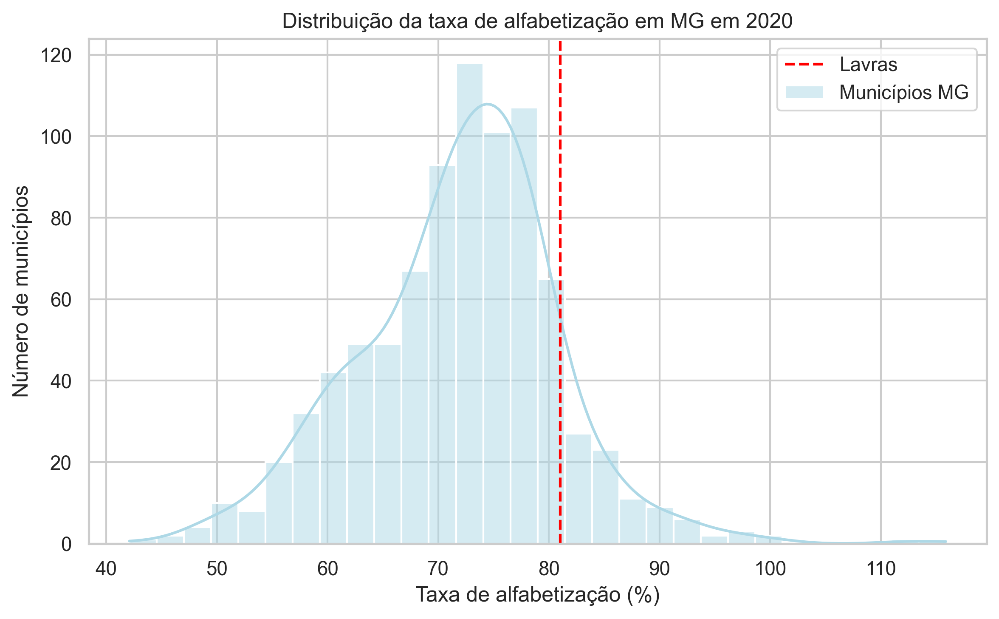
</div>

Nessa tabela, vemos a distribuição de taxa de alfabetização em MG, onde comparamos Lavras com outros múnicipios de Minas Gerais. Os dados da alfabetização são de 2022, devido à dificuldade de encontrar datasets que pudessem se encaixar nos anos de 2016 a 2020, o foco do projeto, usa-se a intuinção de que o número de alfabetizados e não-alfabetizados não tenha mudado muito desde então.

Na estátistica acima, vemos que Lavras possui uma taxa de alfabetização maior que mais da metade dos múnicipios, ao ter um valor aproximado de 80%. Isso indica que boa parte da população sabe ler e escrever, fator esse que afeta suas oportunidades para conseguirem melhores empregos, continuar os estudos, e possibilidade de participar numa democracia.

### Top 10 municípios de MG por população em 2020

<div align="center">
  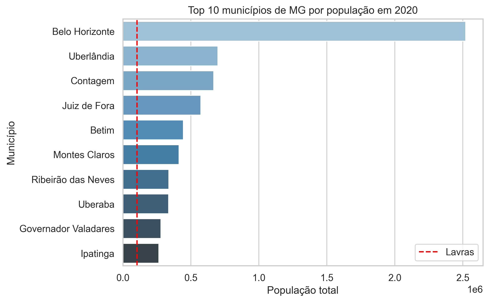
</div>

Comparando o número total populacional de Lavras com os 10 municípios mais populosos de Minas Gerais, notamos que seu valor se encontra muito abaixo deles. Como entendemos que Lavras possuí uma Taxa de Alfabetização maior que a média, pode-se dizer que seu número de habitantes mais baixo afetam na quantidade de pessoas que conseguem ler e escrever no estado de Minas Gerais.

### PIB e Valor Adicionado em Lavras (milhões)

<div align="center">
  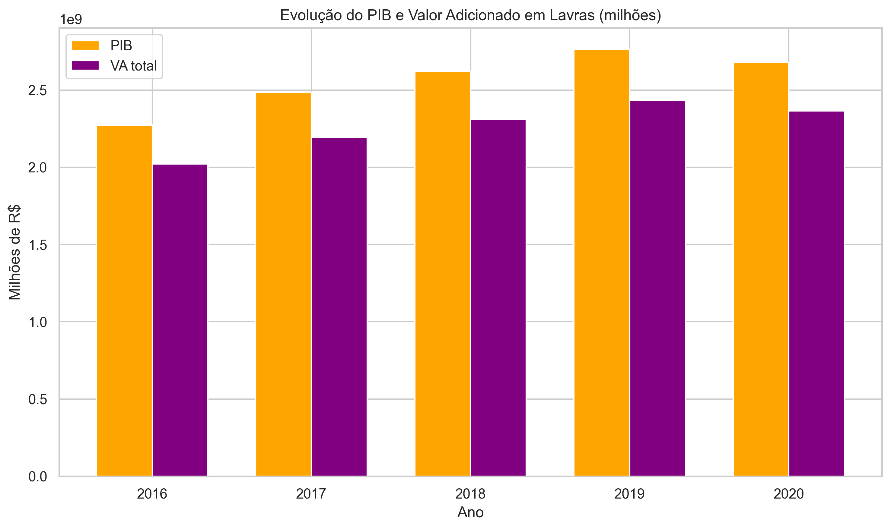
</div>

A comparação entre o PIB e o Valor Adicionado (VA) Total de Lavras revela uma trajetória de crescimento sólido e paralelo entre 2016 e 2019. O gap constante entre as métricas evidencia a estabilidade na geração de impostos líquidos sobre a produção local. Em 2020, observa-se uma leve redução, reflexo direto dos impactos econômicos da pandemia de COVID-19, embora a magnitude da queda indique uma resiliência estrutural superior à de municípios vizinhos menos diversificados.

### Evolução do Indice de Gini dos UFs Médio ao decorrer dos anos

<div align="center">
  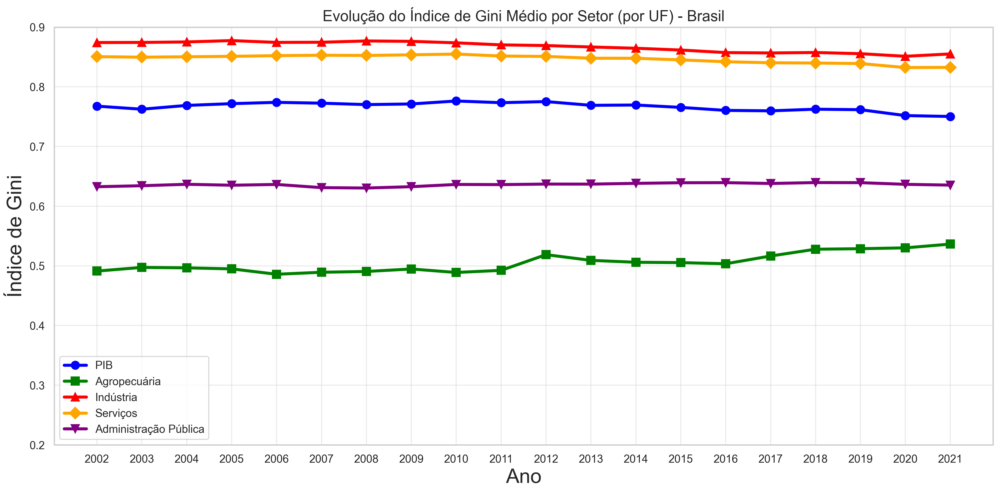
</div>

O gráfico acima mostra o Indice de Gini Médio dos UFs por Setor entre os anos de 2001 a 2021. O Indice de Gini é um indicador que mensura a distribuição de renda em um território. Seu valor varia entre 0 e 1: quando mais próximo de 1, mais desigual é a distribuição de renda em um país; quanto mais próximo de 0, menor é essa desigualdade. O gráfico apresenta a média do indicador ao decorrer dos anos, nota-se que a maioria dos valores permaneceu estável ao decorrer dos anos, com exceção da Agropecuária a qual teve um leve aumento a partir de 2017.

### Matriz de Correlação de Brasil durante 2016 a 2020

Ambas as matrizes de correlação apresentadas utilizam o Coeficiente de Correlação de Pearson. Este cálculo estatístico é utilizado para medir o grau de relação linear entre duas variáveis quantitativas.

O coeficiente varia em um intervalo de -1 a 1:

- 1 (Correlação Positiva Perfeita): Quando uma variável aumenta, a outra aumenta na mesma proporção.
- 0 (Ausência de Correlação): Não existe uma relação linear aparente entre as variáveis.
- -1 (Correlação Negativa Perfeita): Quando uma variável aumenta, a outra diminui proporcionalmente.

<div align="center">
  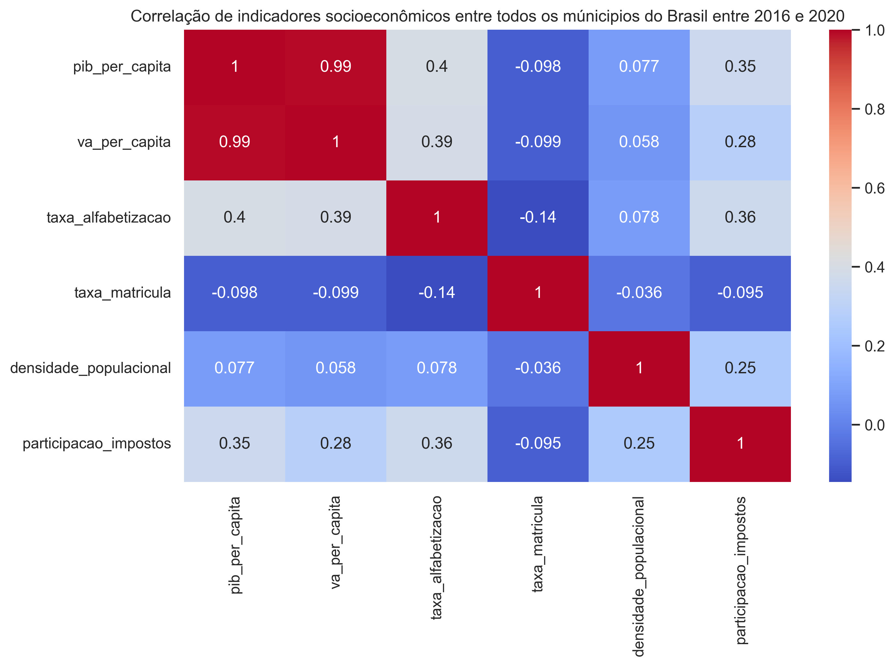
</div>

Na matriz de correlação, observamos como alguns indicadores de Lavras se relacionam entre si:

- O PIB per capita e o Valor Bruto Total a Preços Correntes per capita apresentam forte correlação, indicando que municípios com maior PIB per capita tendem a ter também maior Valor Bruto Total per capita.
- A correlação entre a Taxa de Alfabetização e o PIB per capita, assim como entre a Taxa de Alfabetização e o Valor Bruto Total per capita, foi moderada, sugerindo que municípios com maior renda tendem a ter maior alfabetização, embora essa relação não seja sempre consistente.
- A correlação entre a Taxa de Alfabetização e a Taxa de Matrícula foi a menor positiva, mostrando que a matrícula escolar nem sempre se traduz em alfabetização efetiva.
- Os demais indicadores apresentaram correlação negativa, indicando que aumentos em certos indicadores estão associados a reduções em outros.

<div align="center">
  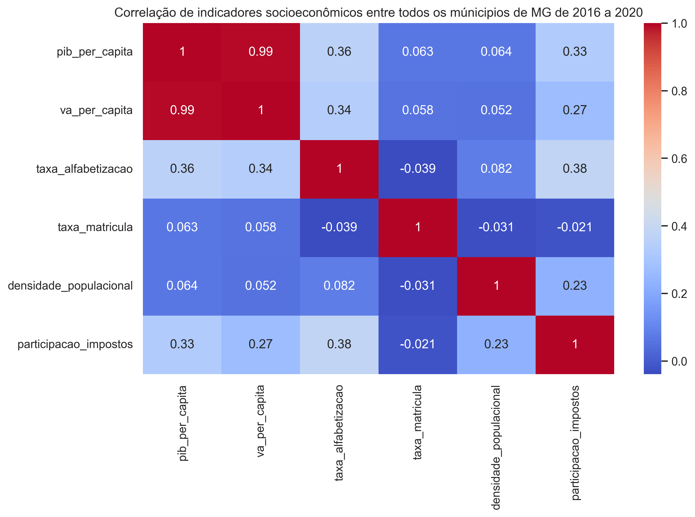
</div>

Analisando essa matriz utilizando apenas informações dos municipios de Minas Gerais, vemos que os resultados são semelhantes do gráfico anterior, com pequenas difereças de valores.

### Gráfico entre valores de População e PIB

<div align="center">
  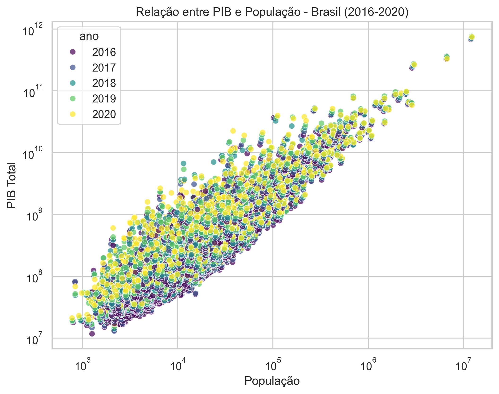
</div>

O gráfico acima demonstra uma relação linear entre as variáveis População e PIB (Produto Interno Bruto) no Brasil durante os anos de 2016 a 2020. Isso mostra que quanto maior a quantidade de habitantes em um múnicipio, a tendência é que o PIB (Produto Interno Bruto) aumente.

## Modelos de IA

### Clusterização por K-Means

<div align="center">
  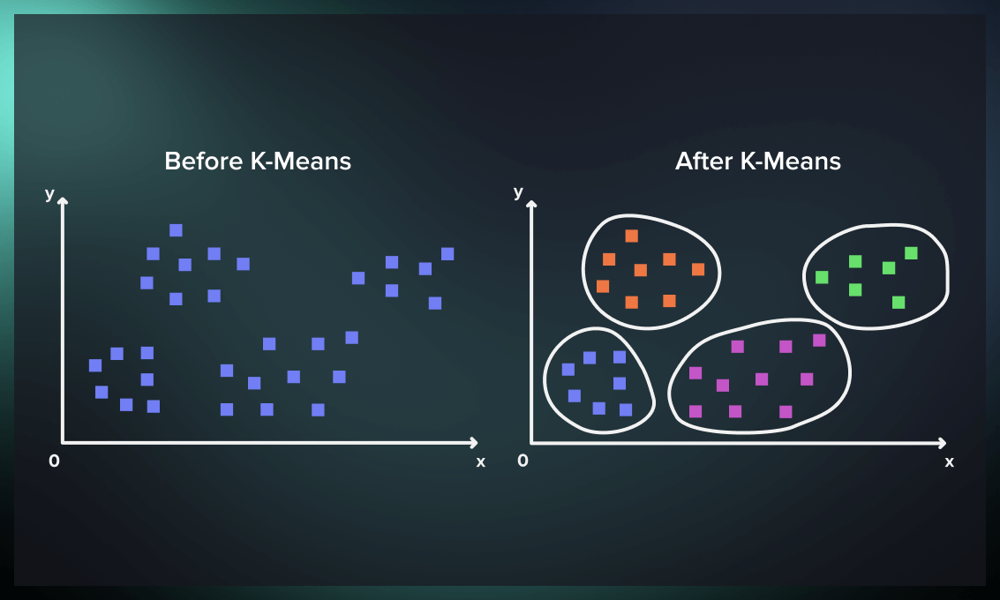
</div>

#### O que é?

O agrupamento K-Means é um algoritmo de aprendizado não supervisionado utilizado para agrupamento de dados, que agrupa pontos de dados não rotulados em grupos ou clusters. É um dos métodos de agrupamento mais populares usados em aprendizado de máquina. Diferentemente do aprendizado supervisionado, os dados de treinamento que esse algoritmo utiliza não são rotulados, o que significa que os pontos de dados não têm uma estrutura de classificação definida.

O K-Means é um algoritmo de agrupamento baseado em centroides iterativo, que divide um conjunto de dados em grupos semelhantes com base na distância entre seus centroides. O centroide, ou centro do cluster, é a média ou a mediana de todos os pontos dentro do cluster, dependendo das características dos dados.

K-Means foi utilizado para o projeto a fim de categorizar municipio que sejam semelhantes entre si utilizando os seguintes fatores: impostos_liquidos, va_agropecuaria, va_industria, va_servicos, e va_adespss. Isso ajudaria a obter insights gerais como "municipios de Cluster X tendem a possuir mais investimento em area Y", além de ajudar na implementação do Random Forest. Usou-se dados entre 2016 a 2020 para o algoritmo de K-Means, a fim de captar a sazonalidade das informações.

Para a seleção do número de clusters que serão utilizados no k-means, foi-se usado o Método do Cotovelo (Elbow Method) para encontrar o 'K' ideal. Tal método é baseada na análise do within-cluster sum of squares (WCSS), que mede a variação dentro dos clusters. A ideia é identificar o “cotovelo” no gráfico, onde a taxa de diminuição muda para cada k significativamente. Nesse projeto foi utilizado 5 clusters. Abaixo é o gráfico do Elbow Method.

<div align="center">
  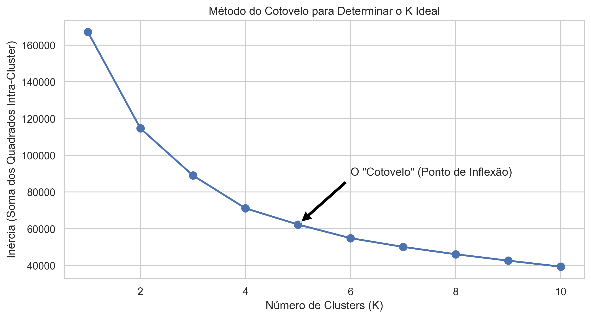
</div>

Adicionalmente, quando o K-Means é executado, obtem se dados com clusters as quais não se sabem exatamente o que eles significam, afinal K-Means é um algoritmo de Machine Learning Não-Supervisionado, os clusters são apenas pontos aos quais registros vão estar mais proximos. Para resover isso, utilizou-se de Clusters Hierarquicos, aos quais utilizam os Clusters Originais do K-Means como base. Eles analisam a Média do PIB de cada Cluster Original, e de ordem crescente dão um novo valor para cada um, e com isso, cria Clusters Hierarquicos. Abaixo está o código para a implementação dos Clusters Hierarquicos:

```python
# Executando o K-Means final com 5 clusters
n_clusters = 5
kmeans = KMeans(n_clusters=n_clusters, init='k-means++', random_state=42)
clusters = kmeans.fit_predict(X_scaled)

# Adicionando o resultado de volta ao DataFrame original
df_aux.loc[df_aux.index, 'cluster_original'] = clusters

# Verificando o perfil médio de cada grupo. Os valores são ordenados de forma crescente
medias_por_cluster = df_aux.groupby('cluster_original')['pib_per_capita'].mean().sort_values()

# Como o index de medias_por_cluster são o valor númerico do cluster, utiliza-se enumarate para então
# criar os Clusters Hierarquicos
mapeamento_ordenado = {cluster_antigo: i for i, cluster_antigo in enumerate(medias_por_cluster.index)}
# Exemplo de valor: mapeamento_ordenado = { '1' : 0, '4' : 1, ...}

# Cria-se uma nova coluna apenas para os Clusters Hieraquicos
df_aux.loc[df_aux.index,'cluster_hierarquico'] = df_aux['cluster_original'].map(mapeamento_ordenado)
```

#### Métricas e Análises

Antes de analisar os gráficos gerados pelo K-Means, primeiro verifica-se o Sillhoutte Score (ou Coeficiente de Silhueta) obtido, esse é uma métrica de validação que mede o quão bem cada município foi alocado ao seu cluster. Enquanto o K-Means usa a distância euclidiana para agrupar, o Silhouette avalia se esse agrupamento foi "justo" ou se o ponto está na fronteira entre dois grupos. 

Para cada município, o coeficiente (s) é calculado usando duas distâncias:

- **$a$** (Coesão): A distância média entre o município e todos os outros pontos do mesmo cluster.
- **$b$** (Separação): A distância média entre o município e os pontos do cluster vizinho mais próximo.

A fórmula é:

$$
s = \frac{b - a}{\max(a, b)}
$$

O coeficiente varia de -1 a 1:

- **Próximo a 1**: O município está muito bem alocado e longe dos clusters vizinhos.
- **Próximo a 0**: O município está na "fronteira" entre dois clusters (indica sobreposição).
- **Valores Negativos**: Indica que o município pode ter sido alocado no cluster errado.

No total, foi obtido um valor aproximadamente 0.35. Indicando que existe uma certa sobreposição entre os clusters, o que faz sentido considerando o tamanho do Brasil e sua complexidade socioeconomica.

Abaixo estão os gráficos gerados com os Clusters Hierarquicos:

<div align="center">
  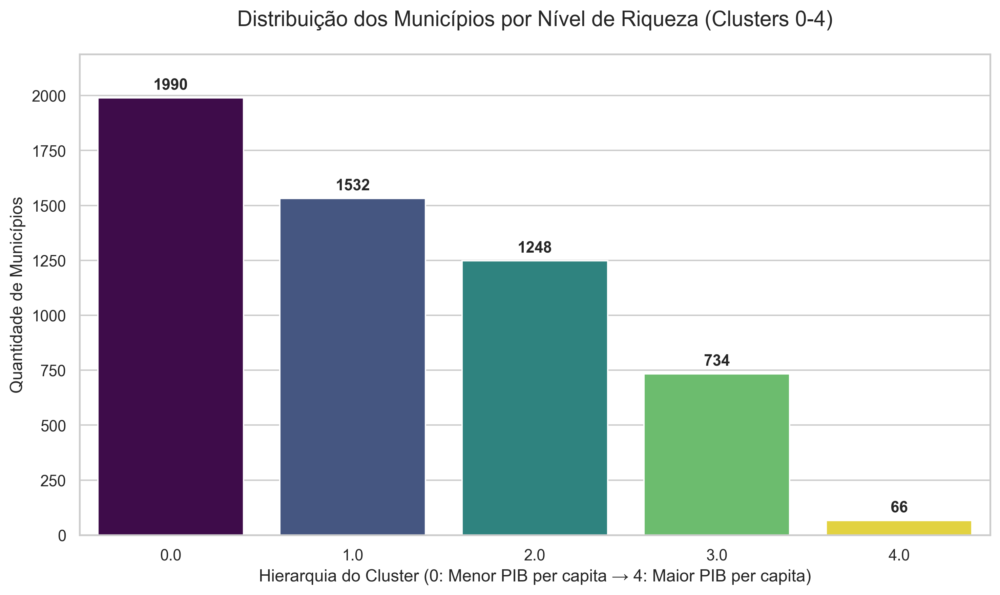
  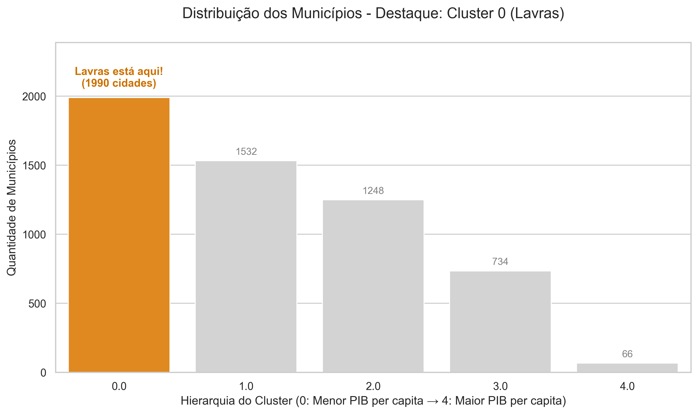
</div>

Dentre os **5570** múnicipios no Brasil:

- **1990** pertencem ao Cluster 0.
- **1532** pertencem ao Cluster 1. 
- **1248** pertencem ao Cluster 2.
- **734** pertencem ao Cluster 3.
- **66** pertencem ao Cluster 4.

Os municipios do Cluster 4, que são aqueles com maior PIB per Capita, representam quase que 1%. O que revela uma enorme discrepância entre quantidade de múnicipios e bens produzidos. O gráfico abaixo melhor reforça essa diferença:

<div align="center">
  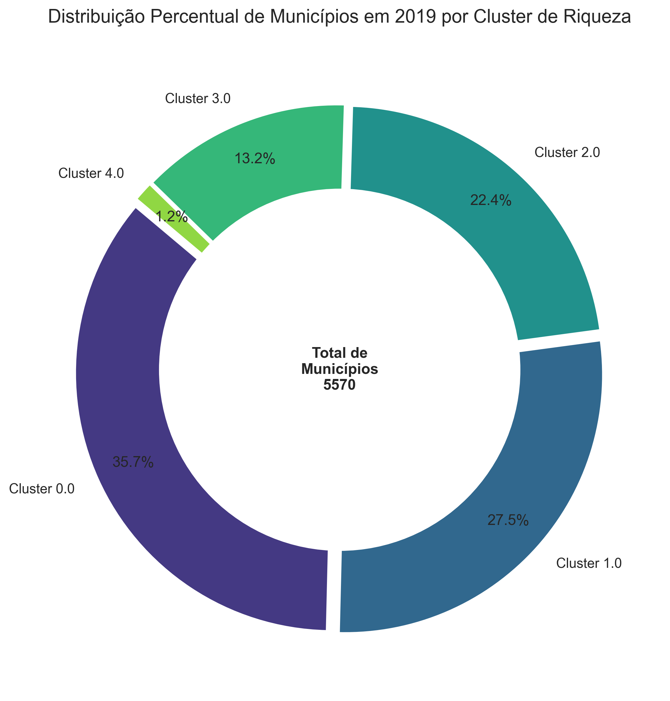
</div>

No geral, 63,2% dos múnicipios brasileiros ou se encontram no Cluster 1 ou Cluster 0. Mais da metade do páis. Sabendo que Lavras concentra-se no cluster 0, sendo que nela reside a UFLA (Universidade Federal de Lavras), umas das maiores referências no setor de Cafeicultura, Zootecnia, Veterinária e Ciências do Solo, que atua desde de 1908 (originalmente fundada como Escola Agrícola de Lavras) e é considerada umas das melhores universidades federais do páis. Pode-se assumir que maioria dos investimentos de Lavras vão para a área de serviços, nisso inclui a UFLA, quando estudantes finalizam o curso, muitas vezes podem não continuar atuando naquele mesmo múnicipio, saindo do local a fim de encontrar mais oportunidades. Em outras palavras, investe-se na Educação em Lavras, contudo esse talento nem sempre permanece no múnicipio, especialmente se os futuros profissionais forem de áreas a qual Lavras não oferece espaço para trabalho.

<div align="center">
  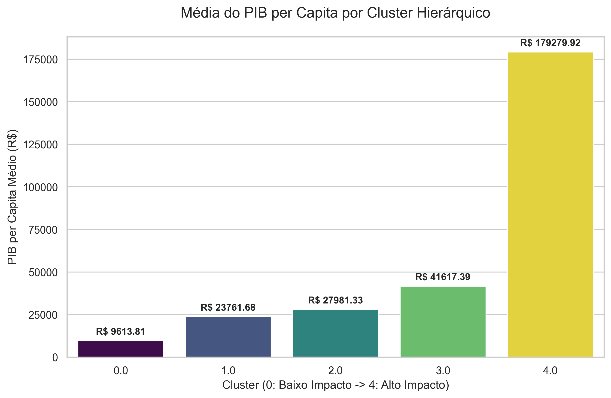
</div>

Apesar de termos 66 municipios no cluster 4, quase 1% da quantidade total de municipios, a tendência é de possuirem um PIB per Capita extremamente maior comparado com o resto dos clusters. A diferença entre essa e o cluster 3, que é a segunda maior média de PIB per Capita, tendo mais de 700 múnicipios agrupados é exorbitante, apenas reforçando a perda de talentos de múnicipios após os estudos na universidade. De resto, Cluster 1 e 2 são os mais estáveis, tendo menor diferença de média entre eles. Enquanto o Cluster 0 permanece por último.

#### Visualização Interativa dos Clusters no Brasil

Abaixo é um mapa interativo do Brasil onde os pontos são múnicipios categorizados pelos seus clusters. Nele conseguimos ver como que municipios de Cluster 0 e 1 se espalham por boa parte do pais, diferente dos outros. Clique na imagem para visualizar o mapa.

[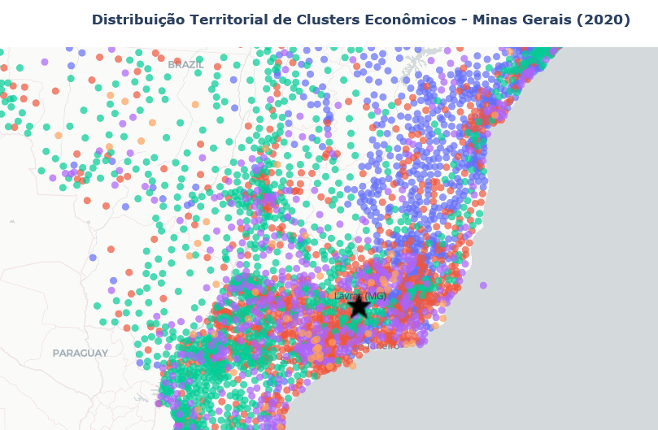](https://desafio-zettalab-ciencia-e-governanca-de-dados.streamlit.app/#visualizacao-interativa-dos-clusters-no-brasil)

#### Gráficos Extras

Abaixo são alguns gráficos adicionais para detalhes menores sobre o Brasil.

<div align="center">
  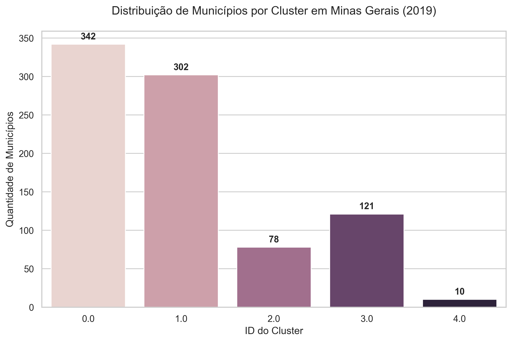
</div>

Minas Gerais é composto em sua grande maioria por municipios com cluster 0 ou cluster 1. Diferente do gráfico da distribuição do Brasil, vemos que o Cluster 3 é o terceiro maior grupo, ao invés de ser o quarto.

<div align="center">
  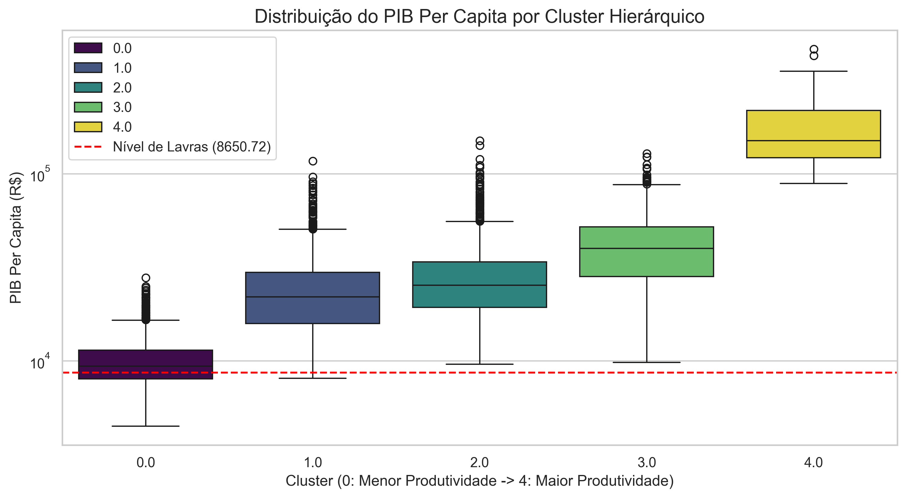
</div>

Inspencionando a distribuição de PIB Per Capita por Cluster Hierárquico, vemos que o múnicipio de Lavras se encontra abaixo da média, diferença essa que é pequena. Apesar disso, cada um dos clusters apresentados oferece outliners no quesito de PIB per Capita, isso é, tendem a ser muito maiores do que a tendência. Tais outliners são representados como esferas brancas.

### Random Forest Regressor

<div align="center">
  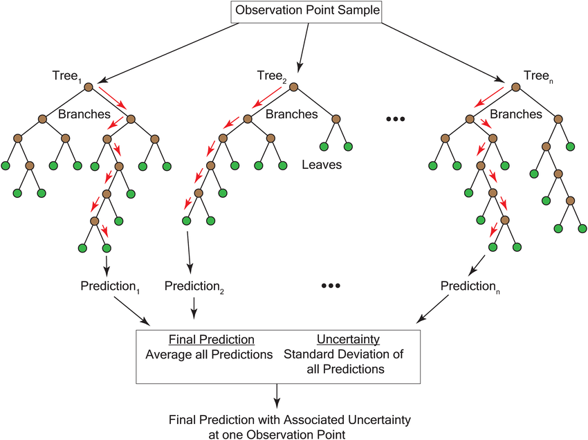
</div>

#### O que é?

Random forest é um algoritmo de aprendizado de máquina amplamente utilizado, que combina a saída de múltiplas decision trees (Arvores de Decisão) para alcançar um único resultado. Sua facilidade de uso e flexibilidade impulsionaram sua adoção, pois lida com problemas de classificação e regressião. Arvores de Decisão são únidades basicas simulam o processo humano de tomada de decisão. Ela utiliza uma estrutura de fluxograma para dividir os dados em grupos cada vez menores e mais específicos até chegar a uma conclusão. Tais unidades sózinhas são altamente sensíveis a variações no grupo de dados aos quais estão sendo utilizados, a fim de minimizar esse problema, o Random Forest é um algoritmo que gera diversas Arvores de Decisão, a quais para problemas de classificação, são determinados pelo voto da maioria, e para casos de regressão, são determinados a partir da média dos resultados.

<div align="center">
  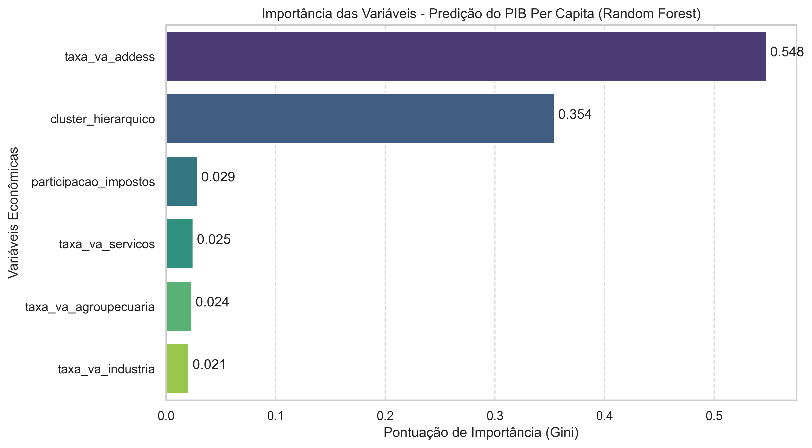
</div>

Este gráfico destaca quais variáveis são mais eficientes para organizar e separar os dados em árvores de decisão.

- Predomínio Absoluto (0.548): A taxa_va_addess detém mais de 50% da importância do modelo, reafirmando-se como o melhor preditor de riqueza.
- Protagonismo do Cluster (0.354): Diferente da regressão, aqui o cluster_hierarquico é a segunda variável mais importante. Isso indica que o agrupamento capturou nuances não lineares essenciais para o modelo.
- Diluição dos Outros Agentes: Variáveis como participacao_impostos (0.029), taxa_va_servicos (0.025), taxa_va_agropecuaria (0.024) e taxa_va_industria (0.021) possuem pesos residuais.

<p align="center">
  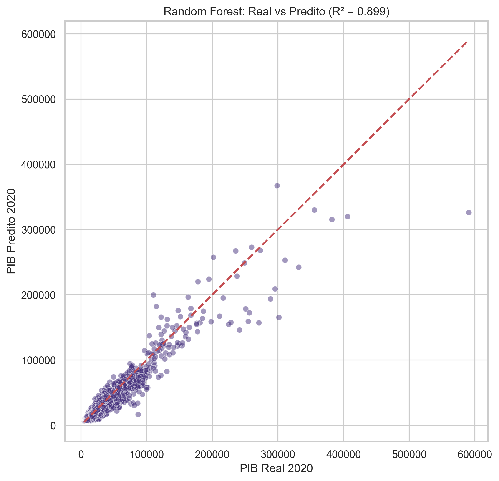
  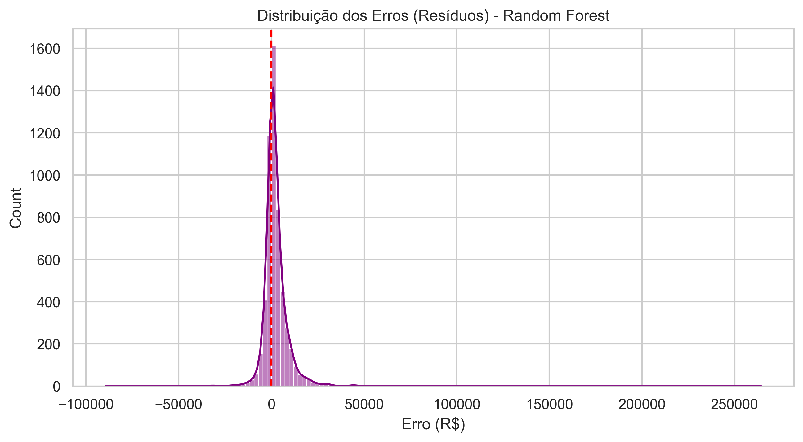
</p>

Análisando a performance do modelo, vemos que ele obteu um R^2 (Coeficiente de Determinação) de 0,8991, indicando que o modelo explica quase 90% da variação do PIB per capita. A maioria dos pontos (municípios) está sobre ou muito próxima à linha tracejada vermelha, o que demonstra uma alta taxa de acerto do algoritmo. Mesmo em valores de PIB muito elevados (acima de 200.000), o modelo mantém uma consistência muito superior à da regressão simples, embora a dispersão aumente levemente nos casos extremos.

Sobre a distribuição de resíduos, a grande massa de dados está concentrada na linha vermelha vertical (erro zero), indicando que o modelo não possui um viés sistemático (não está "viciado" em chutar sempre para cima ou para baixo). A "montanha" roxa é muito alta e estreita, o que significa que, para a vasta maioria dos municípios brasileiros, o erro de predição é extremamente pequeno. Existem alguns erros maiores (caudas que se estendem para a direita e esquerda), representando cidades com comportamentos econômicos únicos que fogem à regra geral da "floresta"..

Ademais, utilizando o MEA (Média de Erros Absoluta), obtemos um valor de 4383.76, o modelo estima o PIB per capita com um desvio médio de aproximadamente 4,3 mil reais, uma margem considerada baixa dada a disparidade econômica entre os municípios brasileiros.

### Regressão Linear Múltipla

#### O que é?

<div align="center">
  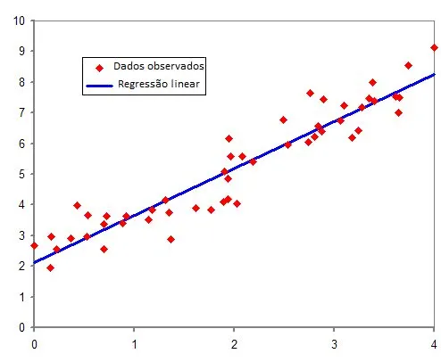
</div>

O modelo de regressão linear é um modelo estatístico versátil para avaliar relacionamentos entre uma resposta contínua e os preditores.

Os preditores podem ser campos contínuos, categóricos ou derivados para que relacionamentos não lineares também sejam suportados. O modelo é linear porque consiste em termos aditivos em que cada termo é um preditor que é multiplicado por um coeficiente estimado. Um termo constante (intercepto) também é geralmente incluído no modelo.

A regressão linear é usada para gerar insights para gráficos que contêm pelo menos dois campos contínuos com um identificado como o destino e o outro como um preditor. Além disso, um preditor categórico e dois campos contínuos auxiliares podem ser especificados em um gráfico e usados para gerar um modelo de Regressão apropriado. 

No nosso caso, utilizamos a Regressão Linear Múltipla, pois trabalhamos com diversos preditores simultaneamente para explicar a variação do PIB.

Para esse projeto, foi utilizamos as features: 'taxa_va_agroupecuaria', 'taxa_va_servicos', 'taxa_va_industria', 'taxa_va_addess', 'participacao_impostos' e 'cluster_hierarquico', a fim de prever o target pib_per_capita. A razão dessa escolha se deve que em valores brutos PIB equivale a soma entre o total de valores adicionados mais os impostos liquidos de um municipio, o cluster hierarquico é um valor adicional para ver se possui alguma relação com o PIB per Capita. Todos os dados utilizados estão a nivel municipal.

A equação geral segue o formato:

$$
\text{PIB}_{pc} = \beta_0 + \beta_1(\text{agro}) + \beta_2(\text{ind}) + \beta_3(\text{serv}) + \beta_4(\text{adm}) + \beta_5(\text{imp}) + \beta_6(\text{cluster}) + \epsilon$$

PIBpc​ (Variável Dependente): É o nosso alvo de predição, representando o Produto Interno Bruto per capita do município.

β0​ (Intercepto): É o valor constante do PIB quando todos os preditores são iguais a zero. Ele representa o ponto de partida da nossa reta de regressão.

β1​ a β6​ (Coeficientes/Pesos): Representam a força e a direção do impacto de cada feature.

    Se um β é positivo, aquela variável contribui para o aumento do PIB.

    Se for negativo, ela indica uma relação inversamente proporcional.

Features (x): São os dados reais de Lavras (Taxas de VA por setor, impostos e o cluster), que alimentam o modelo para gerar a estimativa.

ϵ (Erro Aleatório ou Resíduo): Representa a diferença entre o valor real observado e o valor previsto pelo modelo, capturando variações que as nossas variáveis não conseguem explicar.

Utilizamos a regressão para entender não apenas o "valor" previsto, mas a importância relativa de cada setor. Isso nos permite afirmar, por exemplo, o quanto o aumento em 1% na participação industrial de um município impactaria o seu PIB per Capita final, mantendo as outras variáveis constantes.

<div align="center">
  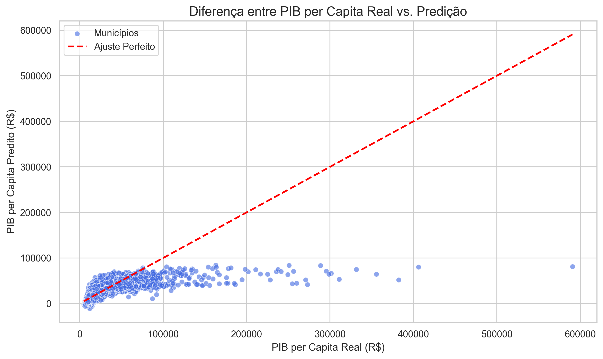
  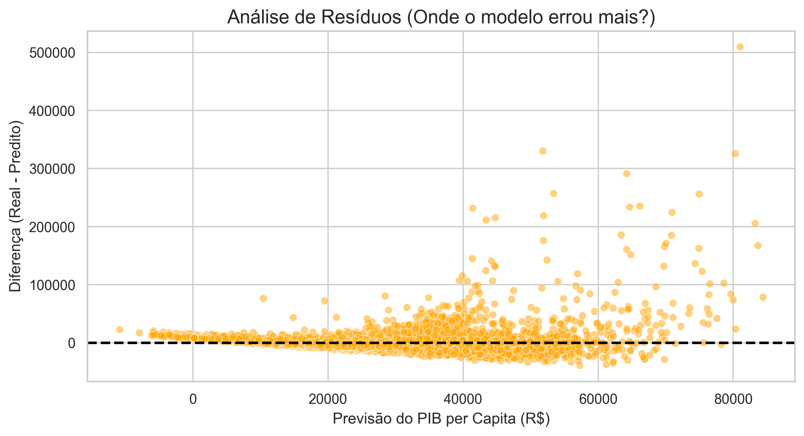
</div>

Para o modelo de Regressão Linear Múltipla, treinamos com dados de 2016 a 2019, a fim de prever os de 2020. Análisando o gráfico a esquerda, vemos que a "nuvem" de pontos azuis concentrada no início mostra que a grande maioria dos municípios brasileiros possui um PIB per capita relativamente baixo e estável. Para essa massa de dados, o modelo é bastante preciso. A linha vermelha representa o ideal, mas os pontos azuis se achatam ao decorrer do gráfico. Isso indica que variáveis lineares baseadas apenas em taxas setoriais (Agro, Indústria, etc.) não conseguem captar o que diferencia uma cidade comum de um "ponto fora da curva" nacional (como capitais financeiras ou polos exportadores).

Sobre a análise de Residuos, vemos que os erros assumem uma forma de "lequê" ou "funil", isso é um reflexo direto da desigualdade econômica brasileira. O modelo erra pouco em cidades pequenas e médias, mas o erro explode em cidades ricas. Como quase todos os resíduos altos estão acima da linha zero, o seu modelo está conservador. Ele prevê uma riqueza "média" baseada nos setores, mas os municípios reais no topo da pirâmide possuem fatores de riqueza (como valor agregado tecnológico ou financeiro) que a regressão linear simples não enxerga.

Como Lavras se encontra no Cluster 0, o quao possui menor PIB per Capita médio, o modelo consegue predizer seu PIB Per Capita com maior confiança, uma vez que ele tende a acertar melhor com numeros menores.

Abaixo estão algumas métricas da Regressão Linear Múltipla:

Começando pelo essa R^2 (Coeficiente de Determinação), ele compara dois erros, o erro do modelo, que é a distância entre os pontos reais e a predição, e o erro da "média". Abaixo é o calculo feito por ele:

$$R^2 = 1 - \frac{\sum_{i} (y_i - \hat{y}_i)^2}{\sum_{i} (y_i - \bar{y})^2}$$

Onde:
- $y_i$: Valor real do PIB per capita.
- $\hat{y}_i$: Valor previsto pelo modelo.
- $\bar{y}$: Média de todos os valores reais de PIB per capita.

O R^2 varia entre: 

- R^2 = 0. Modelo não explica nada.
- R^2 = 1. Modelo explica 100% dos motivos pelos quais o PIB per Capita muda de cidade para outra.

O modelo obteve um R2 de 0,43, o que significa que ele explica 43% da variabilidade econômica dos dados. Os 57% restantes derivam de fatores não capturados pelo dataset atual — como variáveis políticas locais, localização geográfica estratégica e infraestrutura — ou de complexidades socioeconômicas que não seguem um comportamento estritamente linear.

Ademais, temos o MEA (Média de Erros Absoluto), que representa a média das magnitudes dos erros em um conjunto de previsões. Ele nos dá uma ideia de quão "longe" o palpite do modelo está da realidade, em termos absolutos. O MEA é calculado da seguinte forma:

$$MAE = \frac{1}{n}\sum_{i=1}^{n}|y_i - \hat{y}_i|$$

Onde:
- $n$: Número total de municípios.
- $y_i$: Valor real do PIB per capita.
- $\hat{y}_i$: Valor previsto pelo modelo.

O modelo obteve um MAE de 9.095,34, o que indica que, em média, as previsões de PIB per capita divergem cerca de 9 mil reais em relação aos valores reais. Ao analisar essa métrica em conjunto com os gráficos de resíduos, observa-se que esse valor é fortemente influenciado pelos municípios de alta renda (outliers). Para a maioria dos municípios brasileiros, que apresentam uma economia mais estável e normalizada (como o perfil de Lavras), o erro real tende a ser significativamente menor que essa média geral.

<div align="center">
  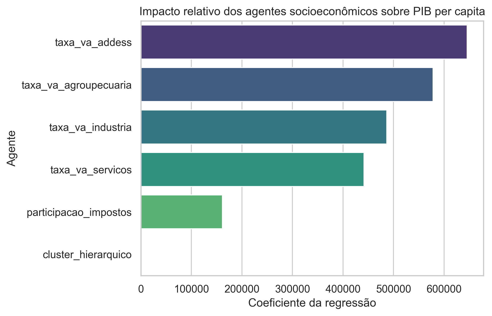
</div>

O gráfico de barras representa o impacto relativo de cada agente socioeconômico sobre a variável alvo (PIB per capita). Em uma Regressão Linear Múltipla, o coeficiente indica o quanto o PIB per capita aumenta para cada unidade de variação na variável independente, mantendo as outras constantes. A taxa de Valor Adicionado em Administração, Defesa, Educação e Saúde Pública aparece como o maior coeficiente. Isso indica que, no conjunto de dados, investimentos e gastos públicos nesses setores têm uma correlação fortíssima com o PIB per capita municipal. Logo em seguida, a taxa_va_agropecuaria e a taxa_va_industria mostram impactos elevados. Cidades com forte produção industrial ou agrícola tendem a apresentar saltos significativos na renda per capita. Embora importante, a taxa_va_servicos aparece em quarto lugar, sugerindo que, embora onipresente, ela gera um impacto proporcionalmente menor no PIB per capita do que a especialização industrial ou pública em alguns municípios. Os Impostos possui um impacto positivo, mas moderado em comparação aos setores produtivos. Por fim, o Cluster Hierárquico tem coeficiente próximo a zero para o que sugere a categoria do grupo, por si só, não é um preditor linear tão forte quanto os valores brutos de produção (VA).


#### Visualização Interativa

Abaixo está um link para acessar um gráfico 3D que mapei os valores de industria e serviço publico, ao PIB. 

[](https://desafio-zettalab-ciencia-e-governanca-de-dados.streamlit.app/#visualizacao-interativa-mapa-valor-industria-e-servicos-ao-pib)

## Importância das Variáveis via SHAP

### O que é SHAP

Os valores SHAP (SHapley Additive exPlanations) são uma forma de explicar o resultado de qualquer modelo de aprendizado de máquina. Ele usa uma abordagem teórica de jogos que mede a contribuição de cada jogador para o resultado final. No aprendizado de máquina, cada recurso recebe um valor de importância que representa sua contribuição para o resultado do modelo.

Os valores de SHAP mostram como cada recurso afeta cada previsão final, a importância de cada recurso em comparação com outros e a dependência do modelo na interação entre os recursos.

Os valores SHAP são independentes de modelo, o que significa que podem ser usados para interpretar qualquer modelo de aprendizado de máquina, inclusive:

- Regressão linear
- Árvores de decisão
- Florestas aleatórias
- Modelos de aumento de gradiente
- Redes neurais

Para os resultados obtidos, utilizamos o modelo Random Forest.

### Valores SHAP obtidos

<div align="center">
  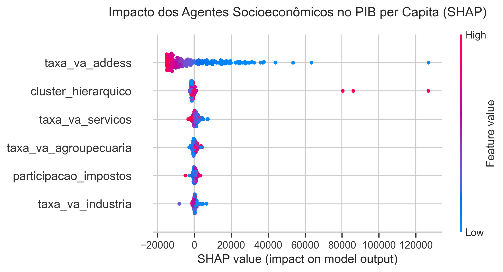
</div>

O gráfico SHAP oferece uma visão detalhada de como cada agente socioeconômico influencia a predição do PIB per capita de forma individualizada para os municípios. Diferente da importância global, aqui vemos a direção e a intensidade do impacto.

**Como ler o gráfico:**

**Eixo X (SHAP value):** Pontos à direita do zero indicam que a variável aumentou a previsão do PIB; pontos à esquerda indicam que ela diminuiu.

**Cores (Feature value):** O rosa representa valores altos da variável, enquanto o azul representa valores baixos.

**Destaques da Análise:**

**Taxa de Administração Pública (taxa_va_addess):** É o fator com maior dispersão. Valores baixos (azul) têm um forte impacto negativo, "puxando" o PIB para baixo, enquanto valores altos (rosa) estão distribuídos, mostrando que o investimento público é uma base necessária, mas não a única garantia de PIB altíssimo.

**Cluster Hierárquico:** Observa-se um comportamento binário interessante. Pontos rosa (clusters específicos) geram impactos positivos extremos (acima de 80.000 no SHAP value), validando que a classificação por grupos captura municípios com dinâmicas de riqueza fora da curva.

**Setores Produtivos (Serviços, Agro e Indústria):** Apresentam impactos mais concentrados em torno de zero, com pequenos grupos (pontos rosa) conseguindo empurrar o PIB para valores positivos. Isso sugere que a especialização extrema nesses setores beneficia apenas uma elite de municípios.

**Participação de Impostos:** Mostra um impacto neutro a levemente negativo quando os valores são baixos, reforçando que a arrecadação caminha junto com a geração de valor local.

Clique na imagem abaixo para ver com detalhes o gráfico no dashboard.

[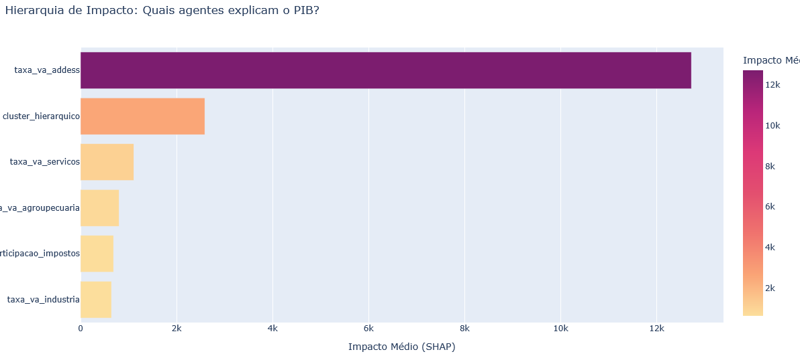](https://desafio-zettalab-ciencia-e-governanca-de-dados.streamlit.app/#visualizacao-interativa-hierarquia)

Este último gráfico apresenta a Hierarquia de Impacto Médio (SHAP), que quantifica a contribuição média de cada variável para a formação do preço final do PIB per capita previsto pelo modelo. O gráfico de impacto médio SHAP consolida a importância de cada agente econômico na decisão final do modelo Random Forest. Ele revela o "peso" médio que cada variável tem ao deslocar a previsão do PIB para longe da média global.

**Destaques da Hierarquia:**

**A Supremacia do Setor Público (taxa_va_addess):** Com um impacto médio superior a 12k, esta variável é o pilar central da previsão. Isso confirma que a estrutura de administração, educação e saúde pública é o fator que mais altera (positiva ou negativamente) a estimativa de riqueza de um município.

**O Valor Estratégico do Grupo (cluster_hierarquico):** O cluster aparece como o segundo fator mais influente, com um impacto médio próximo a 3k. Isso valida a metodologia de agrupamento: pertencer a um determinado perfil socioeconômico é um preditor de riqueza mais forte do que o desempenho isolado de setores como agro ou indústria.

**Setores de Base (Serviços, Agro e Indústria):** Estes agentes apresentam impactos médios menores (entre 1k e 2k). Isso indica que, embora importantes, sua contribuição para o PIB per capita é mais homogênea entre os municípios, não causando desvios tão drásticos quanto a gestão pública ou a classificação do cluster.

## Conclusões Finais

Este projeto seguiu um pipeline completo de Ciência de Dados para entender a dinâmica do PIB per capita dos municípios brasileiros em 2020. Abaixo, destacamos os principais insights de cada etapa:

**1. Análise Exploratória (EDA) e Clusterização**

A exploração inicial revelou uma economia heterogênea, com grandes disparidades regionais. A aplicação da Clusterização Hierárquica foi fundamental para organizar essa complexidade:

- Segmentação Estratégica: Em vez de tratar todos os municípios como iguais, a clusterização criou grupos com perfis socioeconômicos similares.
- Poder Preditivo: O cluster tornou-se uma das variáveis mais importantes nos modelos de Machine Learning, provando que a "vizinhança econômica" (perfil do grupo) dita o ritmo da riqueza local.

**2. Regressão Linear Múltipla: A Base Estrutural**

A Regressão Linear serviu para identificar a tendência média e a elasticidade dos setores:

- Interpretabilidade: Mostrou que, em uma visão simplificada, os setores de Administração Pública, Agropecuária e Indústria possuem os maiores pesos diretos na formação do PIB.
- Limitação: Com um R2 de 0,43, o modelo linear deixou claro que a economia não cresce em linha reta e que existem fatores complexos que exigem modelos mais robustos.

**3. Random Forest: O Salto de Precisão**

Ao mudarmos para o Random Forest, o desempenho saltou para um R2 de 0,899, reduzindo o erro médio (MAE) pela metade (R$ 4.383,76).

- Não-Linearidade: O modelo de floresta entendeu que o impacto de uma indústria em Lavras é diferente do impacto de uma indústria em um polo minerador, ajustando a previsão de acordo com o contexto do cluster.
- Consistência: A distribuição de resíduos concentrada no zero confirmou a alta confiabilidade do algoritmo para a vasta maioria dos municípios brasileiros.

**4. Inteligência Explicável (SHAP)**

O uso do SHAP permitiu "abrir a caixa-preta" do Random Forest:

- Hierarquia de Impacto: Confirmou que a Administração Pública (taxa_va_addess) é o fator que mais move o ponteiro da economia, seguida de perto pelo enquadramento no Cluster.
- Direcionamento: O modelo provou que baixos investimentos em serviços públicos são o principal "freio" para o PIB per capita municipal.

O projeto demonstra que a riqueza municipal brasileira é um fenômeno multidimensional. Enquanto a Regressão Linear nos dá a direção dos setores produtivos, o Random Forest mapeia a realidade com precisão ao considerar as interdependências entre gestão pública e o perfil regional (cluster). Para cidades como Lavras, o sucesso econômico está intrinsecamente ligado à manutenção da sua qualidade administrativa e à sua força como polo regional.

## Limitações e Futuras Implementações

O trabalho realizado, apesar de sua complexidade, possui diversas limitações. Primeiramente, maioria dos dados utilizados trata de questões de investimento e produção de bens, não levando em consideração a composição salarial dos trabalhadores, disponibilidade à saûde, custos de vida, gênero, cor de pele, etnia, entre outros. Além disso, alguns dos dados usados são de tempos diferentes, por exemplo, usou-se a quantidade de pessoas alfabetizadas no ano de 2022, sendo que os dados utilizados nas análises de EDA e IA, são de 2016 a 2020, tais dados de alfabetização foram simplificados, já que os originais consideravam coisas como tipo cor de pele e gênero, a simplificação das informações foi feita para tornar o projeto mais viável, e focar em quesitos economicos e administrativos, buscando gerar comparações entre o municipio de Lavras com os padrões de Minas Gerais e Brasil.  

Futuramente, espera-se adicionar mais dados para preencher os gaps e que estejam conforme a temporalidade dos registros, sem ter que usar suposições de que o numero de alfabetizados de 2022, não seja muito diferente comparado os de 2016 a 2020. Como tambem tratar da reutilização de código encontrada frequentemente no projeto, optando por criar scripts python separados que tratam de questões de mapas e gráficos, pré-processamento, e obtenção de informações, assim melhorando a manuntenção, coesão e desenvolvimento de código.

## Responsável

- Estevão Augusto da Fonseca Santos, Graduando em Ciência de Computação (6° Período). Trilha "Ciência e Governança de Dados" na 2a Edição do ZettaLab